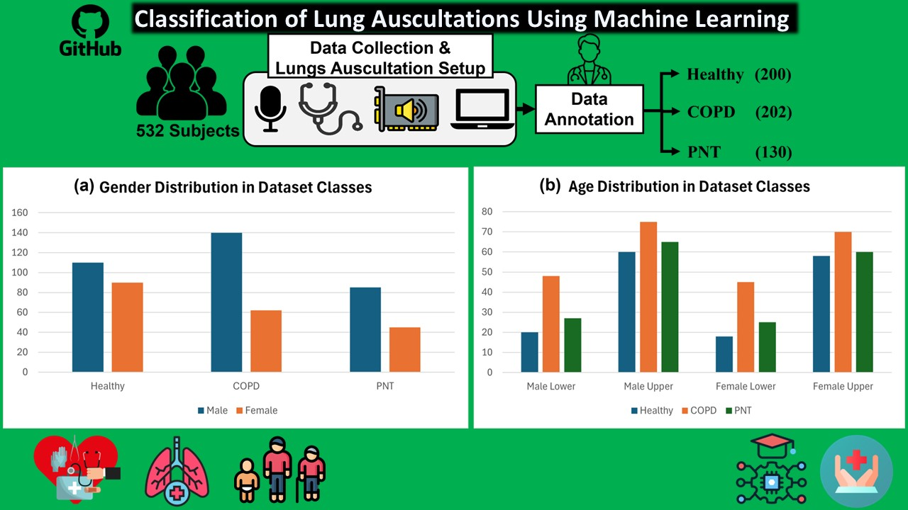

# 📊 🏥  Real-Time Detection and Classification of Lung Auscultations Using Machine Learning

> ⚠️ **Note:** This repository is currently under development and the code will be made publicly available upon the acceptance of the manuscript.

## 🧬 Overview

Pulmonary diseases, driven largely by respiratory inflammation, account for over 3 million deaths globally each year. Accurate diagnosis remains challenging due to overlapping symptoms across various conditions. This research introduces a novel, real-time diagnostic framework based on lung sound (LS) analysis using a purpose-built **Lung Auscultation Acquisition Setup (LAAS)**.

The study involves a unique dataset collected under real-world hospital conditions from **532 subjects**:
- 🟢 200 Healthy individuals  
- 🟡 202 with Chronic Obstructive Pulmonary Disease (COPD)  
- 🔴 130 with Pneumothorax (PNT)



## ✨ Highlights

| 🧩 **Component**              | **Description**                                                                 |
|------------------------------|----------------------------------------------------------------------------------|
| 🏥 **Data Collection**       | Lung sounds acquired using LAAS in real-world clinical settings                 |
| 🧪 **Feature Extraction**    | Wavelet decomposition used for extracting meaningful features                   |
| 🤖 **ML Models Used**        | - Cubic SVM (C-SVM)<br> - Linear SVM (L-SVM)<br> - k-Nearest Neighbors (KNN)<br> - Decision Tree (DT)<br> - Random Forest (RF)<br> - Naive Bayes (NB)<br> - XGBoost<br> - Logistic Regression (LR)<br> - Random Forest with Extra Trees (RF-ET)<br> - AdaBoost (AB) |
| 🏆 **Best Performing Model** | **Cubic-SVM**<br> - 🟢 Normal: 99.5%<br> - 🟡 COPD: 99.5%<br> - 🔴 PNT: 100%        |
| 🔍 **Interpretability**      | SHAP (Shapley Additive Explanations) used to explain model decisions            |

## 🎯 Goals

This repository aims to:
- 🗃️ Share datasets (upon publication)
- ⚙️ Provide complete code for data preprocessing, model training, and evaluation
- 🔍 Include interpretability scripts for SHAP analysis
- ♻️ Enable reproducibility of the results

## 📌 Current Status

⏳ **Under Review**  
This repository will be updated with the full source code and dataset access upon manuscript acceptance.

## Citation
```bitex
@article{sulemanreal,
  title={Real-time Classification of Adventitious Pulmonary Lung Auscultations on Self-Collected Dataset Using Multiple Machine Learning Models and Explainable AI},
  author={Suleman, Ahmad and Khan, Misha Urooj and Khan, Hareem and Fiaz, Mohammad Abdullah Husnain Ali and Baloch, Naveed Khan}
}

